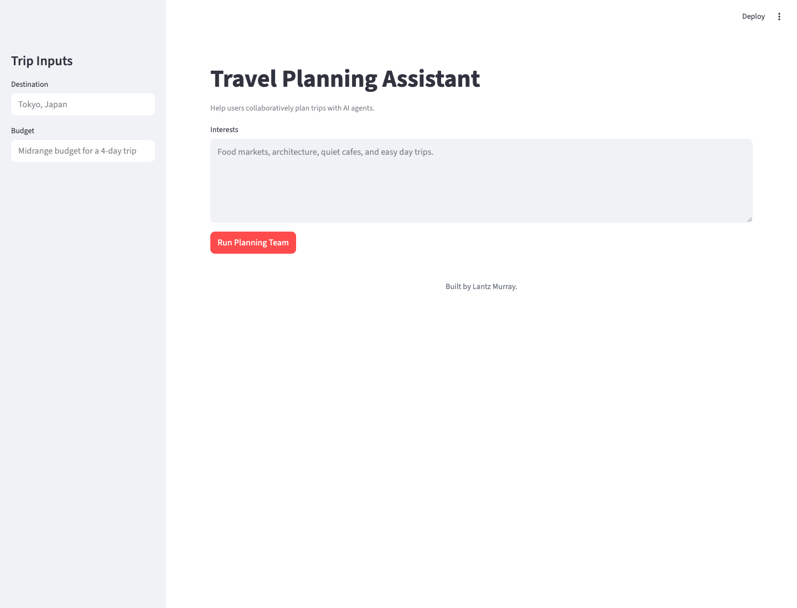

# Travel Planning Assistant

A multi-agent system that helps users collaboratively plan trips with AI agents using local LLM models.

## Screenshot



## Features

- **Multi-Agent Architecture**: Four specialized agents work together to provide comprehensive travel planning assistance
- **Local LLM Integration**: Uses Ollama with LLaMA 2 and other local models for privacy and cost-effectiveness
- **Persistent Memory Storage**: TinyDB-based memory system for tracking planning sessions and agent interactions
- **Interactive Frontend**: Streamlit-based web interface for easy trip planning
- **Self-Contained**: All code and dependencies included in this project - no external shared folder dependencies

## Agents

### 1. Itinerary Builder Agent
- Creates detailed daily itineraries
- Balances activities with rest time
- Considers travel pace and preferences
- Suggests optimal timing for attractions

### 2. Cost Estimator Agent
- Provides comprehensive cost estimates
- Breaks down costs by category (accommodation, food, transport, activities)
- Suggests budget-friendly alternatives
- Tracks spending against budget

### 3. Local Culture Coach Agent
- Provides cultural insights and etiquette tips
- Suggests local experiences and hidden gems
- Offers language and customs guidance
- Enhances travel authenticity

### 4. Packing List Generator
- Builds a practical checklist based on destination, weather, and activities
- Calls out destination-specific items that are easy to forget
- Keeps the trip plan useful after the itinerary is written

## Installation

1. **Navigate to the project directory**:
```bash
cd SchoolOfAI/Official/soai-21-travelplan
```

2. **Install Python dependencies**:
```bash
pip install -r requirements.txt
```

3. **Install Ollama** (if not already installed):
```bash
# Visit https://ollama.ai for installation instructions
# Pull the LLaMA 2 model
ollama pull llama2
```

4. **Start Ollama** (if not already running):
```bash
ollama serve
```

## Usage

### Start the Application

Run the Streamlit frontend:

```bash
streamlit run frontend/app.py
```

The application will open in your browser at `http://localhost:8501`

### Using the Application

1. **Enter Destination**: Where do you want to go?
2. **Enter Travel Dates**: Any timing or trip-length details that help the agents plan
3. **Enter Budget**: Your travel budget range
4. **Enter Interests**: What activities or experiences are you looking for?
4. **Click "Run Planning Team"**: The agents will collaborate to create your itinerary

### Project Structure

```
soai-21-travelplan/
├── README.md                 # This file
├── requirements.txt           # Python dependencies
├── PROJECT_21_GUIDE.md      # Project guide
├── orchestrator.py           # Agent orchestration
├── agents/                  # Agent implementations
│   ├── base.py            # Runtime bridge and utilities
│   ├── itinerary_builder_agent.py
│   ├── cost_estimator_agent.py
│   ├── local_culture_coach_agent.py
│   └── packing_list_agent.py
├── frontend/                # Streamlit UI
│   ├── app.py             # Main application
│   └── components.py       # Reusable UI components
├── runtime/                 # Self-contained runtime
│   ├── __init__.py
│   ├── config.py          # Configuration management
│   ├── llm_client.py      # LLM client interface
│   └── project_runtime.py # Core runtime logic
└── memory/                  # Persistent storage
    └── memory_store.json  # Session data (auto-created)
```

## Configuration

### Environment Variables (Optional)

Create a `.env` file in the project root to customize behavior:

```bash
# LLM Configuration
LLM_PROVIDER=ollama
LLM_MODEL=llama2
LLM_ENDPOINT=http://localhost:11434/api/generate
LLM_REQUEST_TIMEOUT_SECONDS=1800

# AWS Configuration (for Bedrock)
AWS_REGION=us-east-1
AWS_ACCESS_KEY=your_access_key
AWS_SECRET_KEY=your_secret_key

# OpenAI Configuration (optional)
OPENAI_API_KEY=your_openai_api_key
```

### Model Selection

The system supports multiple LLM models:
- `llama2` (default) - Good balance of performance and resource usage
- `mistral` - Faster inference, good for quick iterations
- `codellama` - Specialized for travel logistics and planning

## Data Storage

### Memory Store

Planning sessions and agent interactions are stored in:
- `memory/memory_store.json` - TinyDB database with session history

This file is automatically created when you first run the application.

## Troubleshooting

### Common Issues

1. **Ollama Connection Error**
   - Ensure Ollama is installed and running: `ollama serve`
   - Check if the model is pulled: `ollama pull llama2`
   - Verify Ollama is accessible at `http://localhost:11434`

2. **Import Errors**
   - Ensure you're running from the project directory
   - Install all dependencies: `pip install -r requirements.txt`
   - This project is self-contained - no external shared folder dependencies

3. **Memory Database Issues**
   - Ensure the `memory/` directory exists
   - Check file permissions for `memory/memory_store.json`
   - Delete `memory/memory_store.json` to reset (optional)

### Performance Optimization

- Use appropriate model sizes based on available hardware
- Consider using `mistral` for faster iterations during development
- Monitor memory usage with large planning sessions
- Clear old sessions from memory to improve performance

## Development

### Adding New Agents

1. Create a new agent file in the `agents/` directory
2. Import the agent in `orchestrator.py`
3. Add the agent to the workflow in the `run_workflow` method

### Customizing the Frontend

The frontend uses Streamlit components from `frontend/components.py`. You can:
- Modify `frontend/app.py` to change the UI layout
- Add new components in `frontend/components.py`
- Customize styling and user interactions

## License

This project is part of the School of AI curriculum and follows the same licensing terms.

## Support

For issues and questions:
- Check the troubleshooting section
- Review the project structure and code
- Ensure Ollama is properly installed and running
